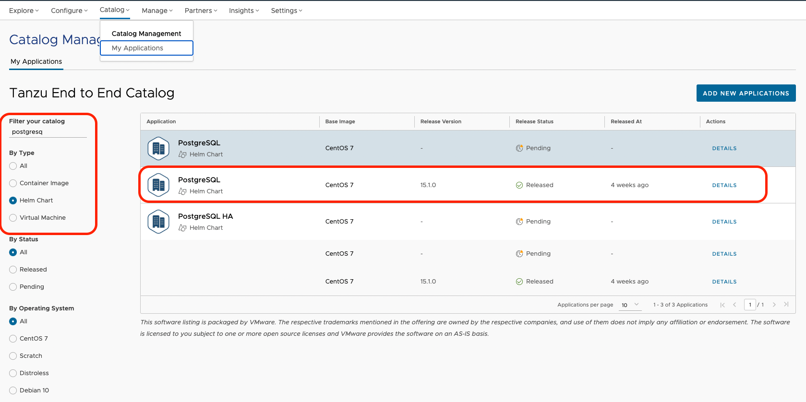

##### VMware Application Catalog - Introduction 

As Chiara (Platform Operator), I know my developers want to use middleware software, and they want to choose OpenSource technology (as they 💙 OpenSource).  
They want to use software **trusted** by my organization, **continuously maintained** and **verifiably tested for use in production** environments. 
Luckily, I can access VMware Application Catalog to generate middleware fitting all my company requirements.  

With VMware Application Catalog (VAC), I will allow Julien access to a bunch of Open Container Initiatives (OCI) and Virtual Machine templates ready to use for the production environment.

**Important**: 
- For the next sections, sign in to console.cloud.vmware.com with your **@vmware.com** email address and select the **"Tanzu End to End"** organization. Please be careful to keep the services or configurations of the clusters in these environments as they are shared for the entire End to End Demo Environment.

Open a tab to VMware Application Catalog in the **"Tanzu End to End"** organization:
```dashboard:open-url
url: https://app-catalog.vmware.com?overview&org_link=/csp/gateway/am/api/orgs/2f31c29c-e042-4ee4-8dbb-3e38b1f1eae5
```
After selecting "Applications" from the menu on the left, I will check if my PostgreSQL database is generated. First, let's filter on PostgreSQL and helm chart type and check if it exists.



Cool! The PostgreSQL helm chart is ready for use by all developers and pushed into the organization container registry. 

As Julien, my App operator confirmed to me the opensource database I want to use is available so I can deploy it:

```terminal:execute
command: helm install emoji oci://harbor.emea.end2end.link/vac-global-library/charts/centos-7/postgresql --set auth.database=emoji --set global.postgresql.auth.existingSecret=db-binding-compatible
clear: true
```

Now, my database is deployed. Let's bind it to my app!! 
