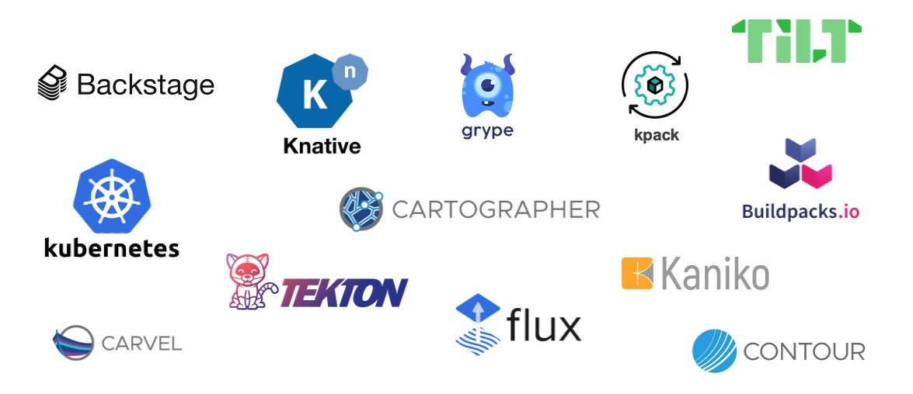

As a customer, I love the idea that all TAP components are OpenSource. This allows me not to lock myself with a specific vendor. 



At this stage, as a Developer I only have to worry about pushing my code to a code repository. My Platform & Security teams are in charge of configuring a TAP Supply Chain to deliver my application to production.

  
**Hi 👋, I am Peter, the TAP Platform Operator!**

I am responsible to deploy TAP and make its access easy for Developers. This includes building a Supply Chain to deliver code to production and give reassurance that all code in production has passed all the steps through an approved company wide workflow. In order for me to make Developers productive, I need to be efficient, hence I would like to build Supply Chains that can be reused for other application deployments. 
Additionally, there are internal teams that only care about using TAP with optimised and configured out-of-the-box tooling and other teams that like freedom of choice when it comes to their own CI/CD tooling. 

I have set the reusable out-of-the-box Supply Chain provided with TAP for the Cody's app.  
This Supply Chain performs the below steps: 

1. **Gitops** - Monitoring code repository for changes
2. **Testing** - Testing application code
3. **Source Scanning** - Scanning application code 
4. **Build** - Buiding application as a container image
5. **Image Scanning** - Scanning the OCI (Open Container Initiative) compliant container image
6. **Container Deployment** - Deploying the application into a Kubernetes cluster
7. **Return a URL** - Creating endpoints and exposing load balancers so the application can be accessed

Once the application is deployed, the application can be accessed it here:
```dashboard:open-url
url: https://inclusion-{{ session_namespace }}.{{ ENV_TAP_INGRESS }}
```
or alternatively by clicking on Runtime Resources in TAP by filtering based on Link=inclusion.
