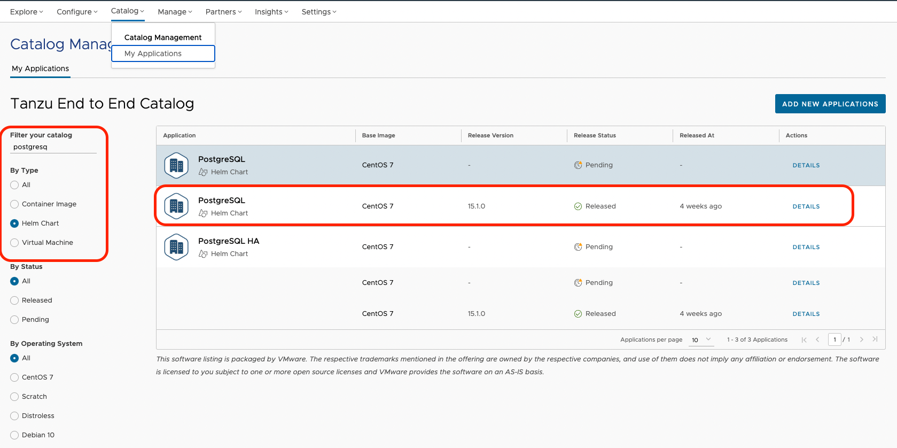

##### VMware Application Catalog - Introduction 

As Chiara (Platform Operator), I know my developers want to use middleware software, and they want to choose technology that is OpenSource (as they 💙 OpenSource). 
They want to use software **trusted** by my organisation, **continously maintained** and **verifiably tested for use in production** environments. 
Luckily, I have access to VMware Application Catalog to generate middleware fitting with all my company requirements. 

With VMware Application catalog (VAC), I will be able to give access Cody to a bunch of Open Container Initiatives (OCI) and Virtual machines templates ready to use for production environment.

**Important**: 
- For the next sections, sign-in to cloud.vmware.com with your **@vmware.com** email address and select the **"Tanzu End to End"** organization. Please be careful not to alter the services or configurations of the clusters in these environments as they are shared for the entire End to End Demo Environment.

###### Login to VMware Marketplace
VMware Application Catalog is part of the VMware Marketplace website, when you are logged into the marketplace inside your organization, you will see this menu :

Open a tab to VMware Application Catalog in the **"Tanzu End to End"** organization.
```dashboard:open-url
url: https://app-catalog.vmware.com?overview&org_link=/csp/gateway/am/api/orgs/2f31c29c-e042-4ee4-8dbb-3e38b1f1eae5
```
Click on the Catalog tab, then in Catalog Management, click on My Applications.

I will check if my postgreSQL Database is generated. Let's filter on postgreSQL and helm chart type and check if it exists.



Cool ! The postgreSQL helm chart is already existing, ready to use by all developers and pushed into the organization container registry... 

As Julien, my App operator confirmed me the opensource Database I want to use is available, so I can deploy it :

```terminal:execute
command: helm install emoji oci://harbor.emea.end2end.link/vac-global-library/charts/centos-7/postgresql --set auth.database=emoji --set global.postgresql.auth.existingSecret=db-binding-compatible
clear: true
```

Now, my database is deployed. Let's bind it to my app!! 
