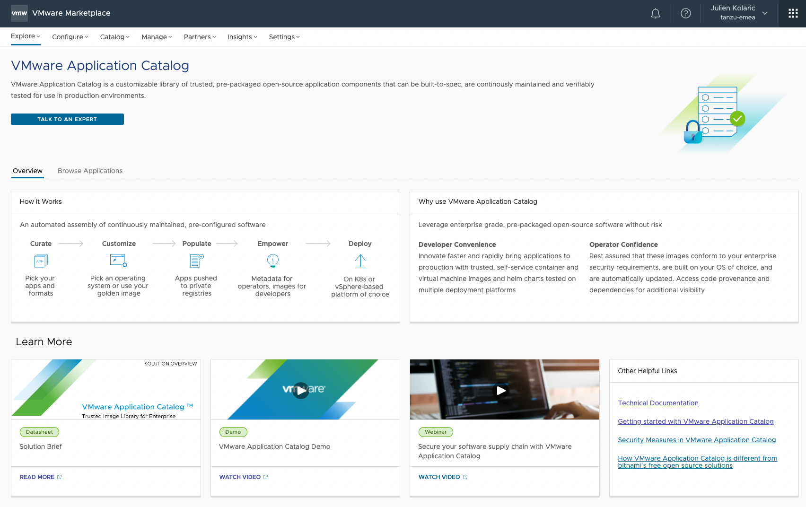
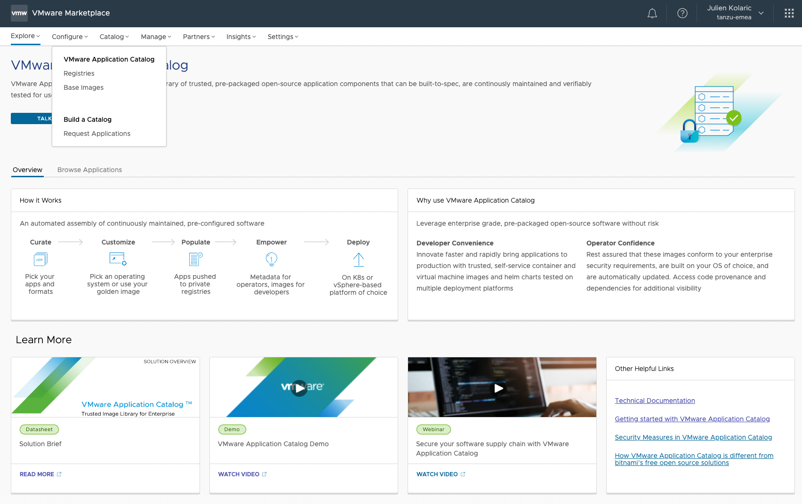
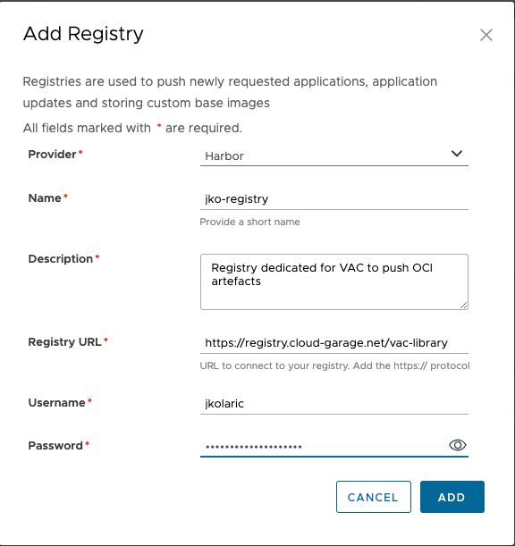
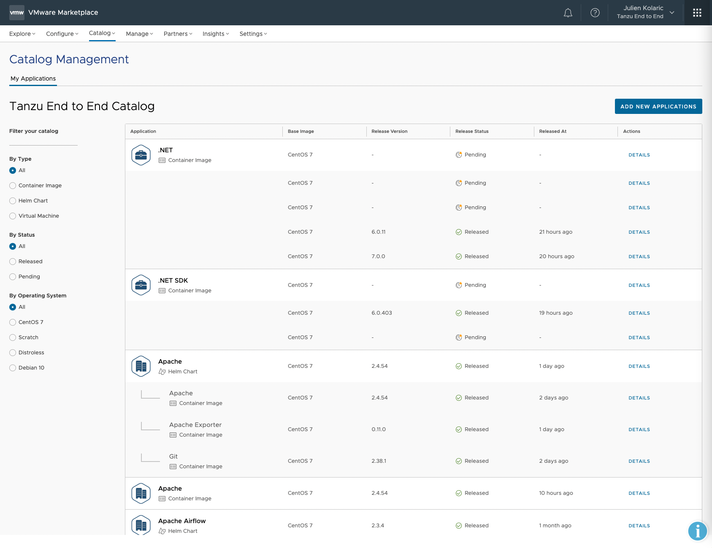
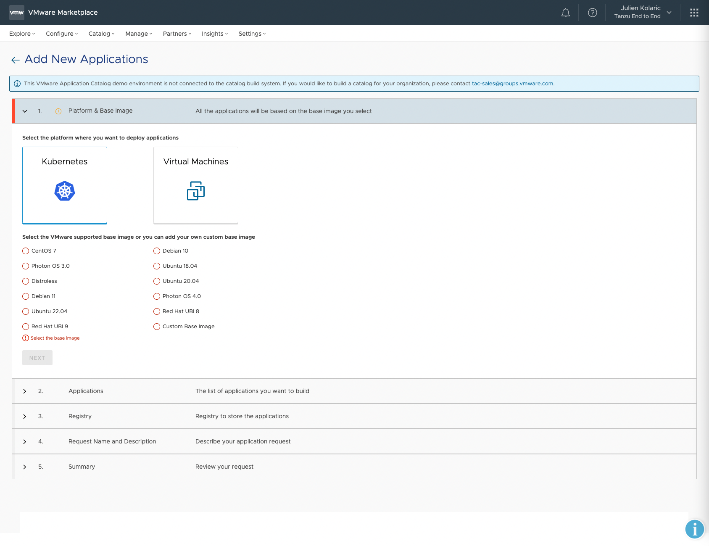
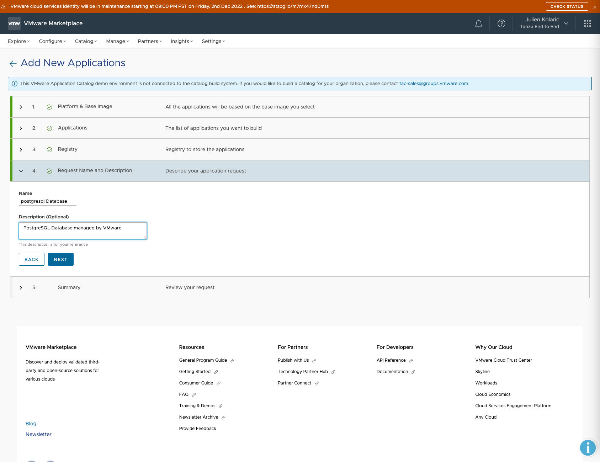
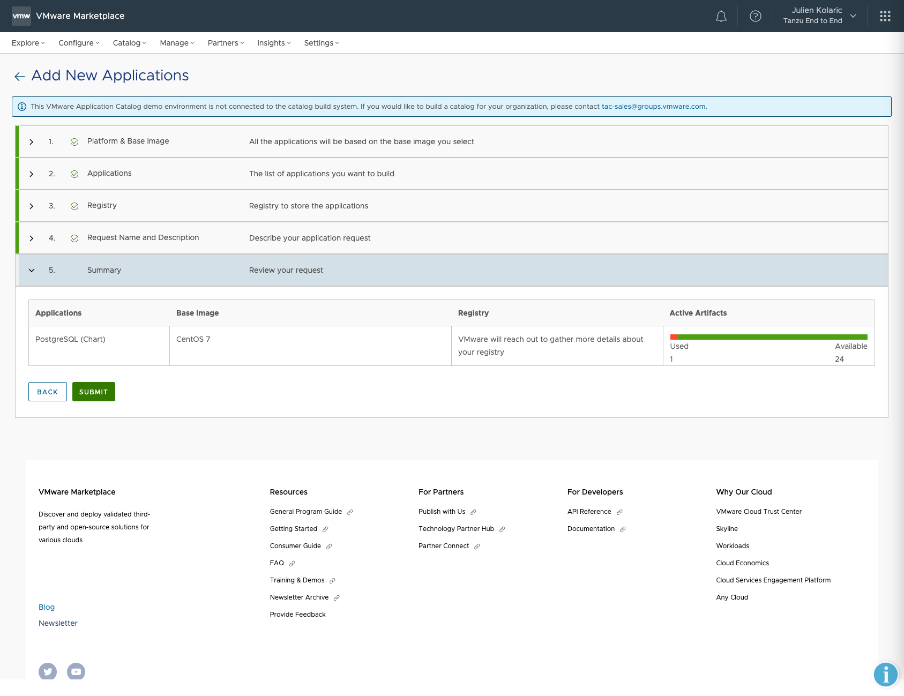
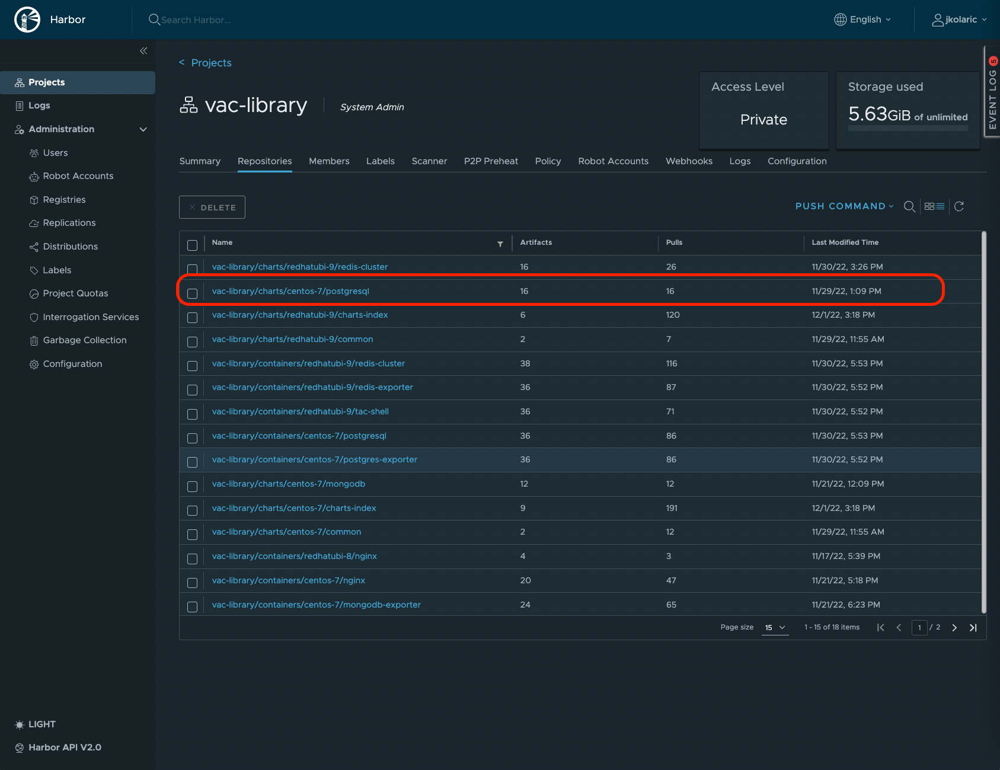

##### VMware Application Catalog - Introduction
Workshop content Date : Dec 1, 2022

**Important**: 
- For the next sections, it is vital that you  make sure to sign-in to cloud.vmware.com with your **@vmware.com** email address and select the **"Tanzu End to End"** organization. Please be careful not to alter the services or configurations of the clusters in these environments as they are shared for the entire End to End Demo Environment.
- The VMware Application Catalog subscription applied in the **"Tanzu End to End"** organization does not allow to generate OCI artefacts. 
- For the next sections, we will assume the customer has a valid subscription and is able to add its own registry into VMware Application Catalog.

To be able to use VMware Application Platform properly, few steps have to be done :
1. Login to VMware Marketplace with a valid VMware Application Catalog Subscription.
2. Add an Open Container Initiative (OCI) compliant registry.
3. Generate your OpenSource curated image.
4. Use your curated image.

###### Login to VMware Marketplace
VMware Application Catalog is part of the VMware Marketplace website, when you are logged into the marketplace inside your organization, you will see this menu :

Open a tab to VMware Application Catalog in the **"Tanzu End to End"** organization.
```dashboard:open-url
url: https://marketplace.cloud.vmware.com/applicationcatalog/view?org_link=/csp/gateway/am/api/orgs/2f31c29c-e042-4ee4-8dbb-3e38b1f1eae5&orgLink=/csp/gateway/am/api/orgs/2f31c29c-e042-4ee4-8dbb-3e38b1f1eae5
```



###### Add an OCI compliant registry 
**Important**: In the **"Tanzu End to End"** organization, the subscription does not allow to add the OCI compliant registry. The following section will show you how to add one to store your applications generated in the next section.

Click on **Configure** and, in the VMware Application Catalog section, click on **Registries** :


You will have the following page available to see your registries or create a new registry :


To add a new registry, click on **"+"** or **"ADD"** and fill the values accordingly.
**Note**: VMware Application Catalog provides support for several registry providers:
1. Harbor
2. Google Container Registry - GCR
3. Azure Container Registry - ACR 
4. Amazon Elastic Container Registry - ECR
5. Jfrog Artifactory Container Registry

In our example, we want to push OCI artefacts generated by VAC in the following registry :
- **Provider** : Harbor
- **Name** : tanzu-se-globals-registry
- **Registry URL** : harbor.emea.end2end.link/vac-global-library


At the end, click on **ADD** to add the registry in the list.

Now the registry is ready to use and we can generate OpenSource software.

###### Generate your OpenSource curated image - Example of a Database

Click on **Catalog**, in the **Catalog Management** section, click on **My Applications**
```dashboard:open-url
url: https://marketplace.cloud.vmware.com/applicationcatalog/view
```

You should see the following page


To create a new application:
1. click on **ADD NEW APPLICATIONS**
2. Select the platform where you want to deploy the application (Kubernetes or Virtual Machines)

In our case, select Kubernetes.


3. Select the VMware supported base image (or you can add your own custom base image)

In our case, let's select **Centos 7** as base image and click on **NEXT**.


4. Select the application(s) you want to package on the Operating System you choose previously

In our case, we want to generate only the postgresql helm chart based on the Centos 7 Operating system, so let's select the **Charts** Format and search for the **postgresql** Application.


Click on **NEXT** to select the registry where you want the application to be pushed

5. Select the registry where you want the application to be pushed

**Reminder:** the current subscription in the **"Tanzu End to End"** organization doesn't allow us to push content into a registry.


To compare with an organization which has a valid subscription, you should have this :


6. Put a **Name** and a **Description** 


7. Summary - Validate the request by clicking on **SUBMIT**


After submitting the request, VMware will process it and the PostgreSQL Helm chart will be pushed into your registry few minutes later (30-45min)

As a result, the following will be pushed into the final registry.


###### Use your curated image created by VMware Application Catalog - Example of a postgreSQL database

To deploy a database through the helm chart provided by VMware Application Catalog in your registry, apply the following helm command :

```terminal:execute
command: helm install emoji oci://harbor.emea.end2end.link/vac-global-library/charts/centos-7/postgresql --set auth.database=emoji --set global.postgresql.auth.existingSecret=db-binding-compatible
clear: true
```

After few seconds, the database application will be deployed. You can check the "running" status thanks to the following command :
```terminal:execute
command: kubectl get pods
clear: true
```
