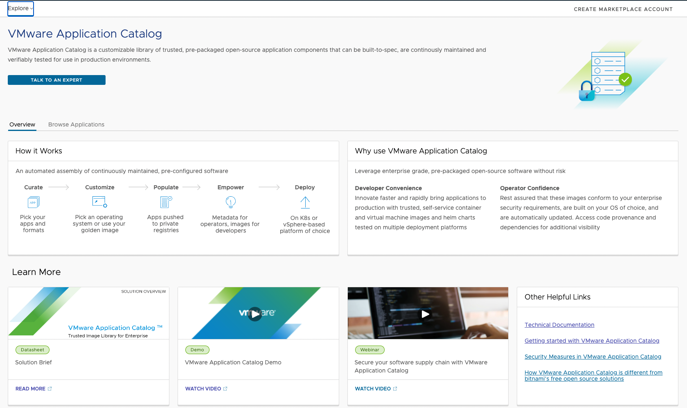

**Where is my Data ?**

As Julien, I have now deployed an app that is running in a container...but containers are ephemeral by nature. 
So, if my container crashes, I will lose all my data 😱!

Moreover, my app is an inclusion app: so if every user adds an emoji and the app crashes, I lose all the emoji. Not really inclusive, isn't it?

It is time to rework my application a bit and add persistence to it by using a PostgreSQL database... I need one which is compliant with my company's security standards.

Luckily, Chiara has come up with a solution for me using VMware Application Catalog!

